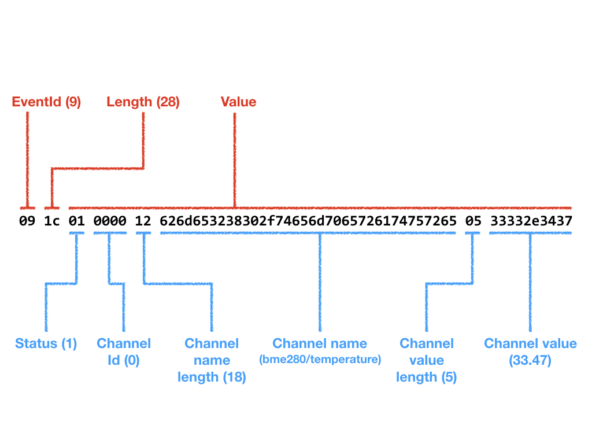

The NoCAN event protocol over TCP/IP
====================================

This document describes the protocol that the `nocand` server uses to communicate
with clients like `nocanc` over TCP/IP.

By implementing this protocol, users can create alternative clients to
`nocanc` or language bindings for C, Python, etc. Note that this protocol should
not be confused with the CAN bus protocol used by nodes to communicate with
each other in a NoCAN network.

A client (e.g. nocanc) initiates a communication with the `nocand` server is
as follows:

* The client connects to server and sends a _ClientHello_ event.
* The server responds with a _ServerHello_ event, including version information.
* The client sends a _ClientAuth_ event, containing a secret API key.
* The server sends a _ServerAck_ event with a "OK" status, if the API key is correct.
* The client sends a _Subscribe_ event, containing all event types it wants to receive.
* The server sends a _ServerAck_ event confirming the subscription.

After this initialisation, the server will push subscribed events to the client.
The client can send events to the sever as well at any time.

The NoCAN event manager typically listens for connections on TCP port 4242,
though this is fully configurable by the user. The protocol described in this
document should be usable without change to run over TLS/SSL, as an option
available in the future.

Event packets
-------------

Events are encoded in packets with the following structure:

|EventId  |Length       |Value
|---------|-------------|------
| 1 byte  | 1-5 byte(s) | _Length_ byte(s)

`EventId` is a number that uniquely identifies the type of event.
`Length` describes the size of the following event value.
`Value` describes data associated to the event. The structure and size of
`Value` is event dependent. In general, `Value` elements are encoded with
the most significant byte first.

### EventId

The event identifier `EventId` is represented as one byte. Currently, there are 20
different types of events:

```go
const (
    NoEvent                          EventId = 0
    ClientHelloEvent                         = 1
    ClientAuthEvent                          = 2
    ClientSubscribeEvent                     = 3
    ServerAckEvent                           = 4
    ServerHelloEvent                         = 5
    BusPowerStatusUpdateEvent                = 6
    BusPowerEvent                            = 7
    ChannelUpdateRequestEvent                = 8
    ChannelUpdateEvent                       = 9
    ChannelListRequestEvent                  = 10
    ChannelListEvent                         = 11
    NodeUpdateRequestEvent                   = 12
    NodeUpdateEvent                          = 13
    NodeListRequestEvent                     = 14
    NodeListEvent                            = 15
    NodeFirmwareUploadEvent                  = 16
    NodeFirmwareDownloadRequestEvent         = 17
    NodeFirmwareDownloadEvent                = 18
    NodeFirmwareProgressEvent                = 19
    NodeRebootRequestEvent                   = 20
    BusPowerStatusUpdateRequestEvent         = 21
    DeviceInformationRequestEvent            = 22
    DeviceInformationEvent                   = 23
    SystemPropertiesRequestEvent             = 24
    SystemPropertiesEvent                    = 25
)
```

These events are detailed in the following section ("Events Semantics").

### Length

The encoding of `length` is almost similar to the one used in ASN.1 DER:

* If `length<=128` then `length` is encoded as one byte.
* if `length>128` and `length<256` then `length` is encoded as the character
`0x81` followed by the value of `length` as one byte.
* if `length>=256` (i.e. 2^8) and `length<65536` then then `length` is encoded as the
character `0x82` followed by the value of `length` as two byte, most
significant byte first.
* if `length>=65536` (i.e. 2^16) and `length<16777216` then then `length` is
encoded as the character `0x83` followed by the value of `length` as three
byte, most significant byte first.
* if `length>=16777216` (i.e. 2^24) and `length<4294967296` then then `length`
is encoded as the character `0x84` followed by the value of `length` as three
byte, most significant byte first.

Examples:

* 15 is encoded as [ 0x0F ]
* 150 is encoded as [ 0x81 0x96 ]
* 1500 is encoded as [ 0x82 0x05 0xDC ]

### Value

Values are encoded as a string of bytes.
The encoding is event dependent and is described hereafter in the section
titled "Event Specification".
As a general rule, multi-byte numbers (e.g. a 16 bit integer) contained
within a structured value are represented with their most significant byte first.

Examples:

* As a 16 bit number, 258 is encoded as the string of bytes [ 0x01 0x02 ]
* As a 32 bit number, 258 is encoded as the string of bytes [ 0x00, 0x00, 0x01 0x02 ]
* As a 32 bit number, 3735928559 is encoded as [ 0xDE 0xAD, 0xBE, 0xEF ]

### Server decoding error

When a server fails to decode an event it will respond with a **ServerAckEvent**
with an Ack code set to 1 or 4, and will close the connection.

See below for further details about the **ServerAckEvent**.

Event Specification
---------------

This section describes how an event **Value** is encoded, depending on the
specified **EventId**.

The following figure shows an example of a **ChannelUpdate** event message.
The **EventId** is 9, the value length is 28 and the event value is further
broken down into subfields according to the structure of a **ChannelUpdate**
event value.



### ClientHelloEvent (1)

This event is sent at the start of session by the client. It contains no value
and has a null length.

The server should respond with a **ServerHelloEvent**.

### ClientAuthEvent (2)

A client sends an **ClientAuthEvent** to authenticate to the server, by
presenting an authentication token.
If the authentication is successful the client will be authorised to send
any type of event to the server. Unauthenticated clients can only send
**ClientAuthEvent** and **ClientHelloEvent** messages.

The content of the **ClientAuthEvent** message is simply a string representing
an authentication token:

| Authenticator |
|---------------|
| n byte(s)     |

The server will respond to this message with a **ServerAckEvent**.
If the authentication is successful, the server will set a response code to
0. The client can then use the **ClientSubscribeEvent** message to select
what data it wants to receive from the server.

### ClientSubscribeEvent (3)

This message allows the client to specify what messages (events) it wants to
receive from the server. While the client can send any type of event, the
server will only send events that are specified through the
**ClientSubscribeEvent** message (in addition to the **ServerAckEvent**
which is always sent).

The **ClientSubscribeEvent** message value is formed as a list of EventId
codes, describing the events the client subscribes to:

| Event Id 1  | Event Id 2  | ... | Event Id N
|-------------|-------------|-----|------------
| 1 byte      | 1 byte      | ... | 1 byte

In response to this message, the server will send a **ServerAckEvent** message.

### ServerAckEvent (4)

This message indicated the success or failure of the last operation requested
by the client (e.g. authentication).

The value is a a one byte string:

| Ack code |
|----------|
| 1 byte   |

The meaning of the Ack code is as follows:

| Ack Code | Meaning
|----------|----------
| 0        | Success
| 1        | Bad or Malformed Request
| 2        | Unauthorised / missing authentication
| 3        | Not found
| 4        | General failure

### ServerHelloEvent (5)

This event is sent by the server to the client in response to a **ClientHelloEvent**.
The value of this event is a fixed string of 4 bytes:

| Byte 1 | Byte 2 | Byte 3 | Byte 4 |
|--------|--------|--------|--------|
| 0x45   | 0x4D   | 0x01   | 0x00   |

Byte 3 and byte 4 are used to indicate the major and minor version of then
event manager server. Currently, this is 1.0 as shown above.

Once the client has received a **ServerHelloEvent**, it should proceed with a
**ClientAuthEvent**.

### BusPowerStatusUpdateEvent (6)

The server will periodically send a **BusPowerStatusUpdateEvent** message
reflecting the power status of the NoCAN network.

The value of this event is structured as follows:

| Status | Voltage           | Current sense | Reference Level
|--------|-------------------|---------------|-------------------
| 1 byte | 4 bytes (float)   | 2 bytes       | 4 bytes (float)

The value is encoded in big endian.

**Status** is an array of bits representing the state of the CAN bus driver.

| Bit  | Name       | Description
|------|------------|--------------
| 0    | RX\_PENDING | A CAN bus message is available in the driver.
| 1    | TX\_PENDING | The output transmission buffer of the driver is full.
| 2    | N/A        |
| 3    | N/A        |
| 4    | ERROR      | A network error occurred.
| 5    | FAULT      | An over-current event caused the driver to shut down power.
| 6    | POWERED    | The network is powered.
| 7    | CAN\_RES    | The 120 ohm termination resistor is disabled on the PiMaster.

**Voltage** is a 32 bit float representing the measured voltage on the network (e.g. 12V).

**Current Sense** is a 16 bit value representing a rough estimation of the current used by the network.

**Reference Level** is a 32 bit float representing the measured voltage on the PiMaster board MCU (typically 3.3V).

### BusPowerEvent (7)

When the server sends a **BusPowerEvent** it means that the power on the NoCAN
network has been switched on or off.

This message has a one byte value:

| Power       |
|-------------|
| 1 byte (0x00 = off, 0x01 =  on) |

When a client sends a **BusPowerEvent** to the server, it means that it
requests the power to be switched on or off on the NoCAN network.
The server will respond with a **BusPowerEvent** reflecting the state of the
power on the network (it should be the same message as the client sent).

### ChannelUpdateRequestEvent (8)

A client will send a **ChannelUpdateRequestEvent** to ask the server to
report the status of a particular channel.

The message has the following structure:

| Channel Id | Channel name length | Channel name
|------------|---------------------|-----------------
| 2 bytes    | 1 bytes             | 0 to 63 bytes

The **Channel Id** represents a 16-bit channel identifier.
The **Channel Name** is the textual name of the channel.
The client can specify a channel either by id or by name.
When the **Channel Id** is not 0xFFFF, this value is used to specify a channel.
When the **Channel Id** is 0xFFFF, the name is used instead.

The server will respond to this request with a **ChannelUpdateEvent**.

### ChannelUpdateEvent (9)

A server will send a **ChannelUpdateEvent** of any change occurs on a channel
or if it receives a **ChannelUpdateRequestEvent** from a client. Notably, a **ChannelUpdateEvent**
will be emitted each time data is published on a channel.

The message has the following structure:

| Status | Channel Id | Channel name length | Channel name    | Channel value length | Channel Value
|--------|------------|---------------------|-----------------|----------------------|---------------
| 1 byte | 2 bytes    | 1 bytes             | 0 to 63 bytes   | 1 byte               | 0 to 63 bytes

The Status byte can have the following values:

| status | Description
|--------|------
| 0      | A channel was created.
| 1      | A channel was updated, data was published on the channel.
| 2      | A channel was destroyed.
| 3      | The requested channel does not exist (in response to a **ChannelUpdateRequestEvent** only).

The fields **Channel Id** and **Channel Name** are the same as in the
**ChannelUpdateRequestEvent**.

The field **Channel value** represents the current content of a channel.
It is non-empty when status is 1 (channel updated);
in all other cases, **Channel value length** is 0 and **Channel value** is empty.

### ChannelListRequestEvent (10)

When the client sends this message, the server will respond with a
**ChannelListEvent** containing a list of all active NoCAN channels.

This message has no value.

### ChannelListEvent (11)

The server will sent a **ChannelListEvent** in response to a
**ChannelListRequestEvent** sent by a client.

The message has the following structure:

| Channel Update event 1 | ...     | Channel Update event x
|------------------------|---------|------------
| N[1] bytes             | ...     | N[x] bytes

Each block in this message has the structure defined in the
**ChannelUpdateEvent** message described previously.

### NodeUpdateRequestEvent (12)

The client can send a **NodeUpdateRequestEvent** to request the server to send
information about the state of a particular node in a NoCAN network.

| Id     |
|--------|
| 1 byte |

**Id** is a number between 1 and 127 that identifies a node.

The server will send a **NodeUpdateEvent** in response to this message.

### NodeUpdateEvent (13)

The server will send a **NodeUpdateEvent** when the state of a node changes or in response
to a **NodeUpdateRequestEvent**.

The message has the following structure:

| Id     | State  | UDID      | Last seen
|--------|--------|-----------|------------
| 1 byte | 1 byte | 8 bytes   | 8 bytes

**Id** is a number between 1 and 127 uniquely identifying the node in the NoCAN
network.

**State** described the current state of a node.

**UDID** is a 8 byte identifier of the node, globally unique across all NoCAN
networks.

**Last seen** is a 64 bit number, encoded with the most significant byte first,
which represents a UTC nanosecond timestamp indicating when the node was last
seen (time starts on Jan 1st, year 1 at 00:00:00).

### NodeListRequestEvent (14)

When the client sends this message, the server will respond with a
**NodelListEvent** containing a list of all active NoCAN nodes.

This message has no value.

### NodeListEvent (15)

The server will sent a **NodeListEvent** in response to a
**NodeListRequestEvent** sent by a client.

The message has the following structure:

| Node Update event 1 | ...     | Node Update event x
|---------------------|---------|------------
| N[1] bytes          | ...     | N[x] bytes

Each block in this message has the structure defined in the
**NodeUpdateEvent** message described previously.

### NodeFirmwareUploadEvent (16)

A client will send a **NodeFirmwareUploadEvent** to upload a new firmware to a node.

After the client sends this message, the server will send **NodeFirmwareProgressEvent** messages to the client
until the firmware has been successfully uploaded.

The message has the following structure, which is common to the **NodeFirmwareDownloadEvent** message event
as well as the **NodeFirmwareDownloadRequestEvent**:

| Node Id | Download | Limit   | Firmware blocks
|---------|----------|---------|-----------------
| 1 byte  | 1 byte   | 4 bytes | N bytes

**Node Id** identifies the node to be updated.

**Download** describes whether the event relates to firmware upload (0x00) or firmware download (0x01).
This value is 0x00 for a **NodeFirmwareUploadEvent** and 0x01 for a **NodeFirmwareDownloadEvent**.

**Limit** is used for downloads and sets a limit on the maximum number of bytes to download. This value is
ignored for a **NodeFirmwareUploadEvent** and can be safely set to 0 in that case.

**Firmware blocks** is an array of block of flash memory content that have the following structure.

| Offset  | Length  | Data
|---------|---------|-------------
| 4 bytes | 4 bytes | _Length_ bytes

Where:

- **Offset** describes the flash starting address.
- **Length** described the length of the flash data.
- **Data** is the actual data.

For a **NodeFirmwareUploadEvent** a firmware block describes data to be written to flash.

For a **NodeFirmwareDownloadEvent** a firmware block describes data that was read from flash.

For a **NodeFirmwareDownloadRequestEvent** the firmware block is empty.

There is usually only one firmware block in a **NodeFirmwareUploadEvent** or a **NodeFirmwareDownloadEvent**.

### NodeFirmwareDownloadRequestEvent (17)

A client will send a **NodeFirmwareDownloadRequestEvent** to download firmware from a node.

The message has the same structure as a **NodeFirmwareUploadEvent** described above, with the following specifics:

- **Limit** sets the maximum flash download size, where a value of 0 means all the flash (248K).
- **Firmware blocks** is empty and has therefore a null length.

After the client sends this message, the server will send several **NodeFirmwareProgressEvent** messages to the client
until the firmware has been successfully downloaded.

Once the firmware has been successfully downloaded, the server will send a **NodeFirmwareDownloadEvent** with the
content of the downloaded firmware.

### NodeFirmwareDownloadEvent (18)

A server will send this message to a client once a flash download is completed, after being initiated by a
**NodeFirmwareDownloadRequestEvent**.

The message has the same structure as a **NodeFirmwareUploadEvent** described above, with the following specifics:

- **Download** has the value 0x01.
- **Firmware blocks** contains exactly one block, with the downloaded firmware.

### NodeFirmwareProgressEvent (19)

During the upload or download of firmware, the server will send **NodeFirmwareProgressEvent** indicating the progress
of the operation.

The message has the following structure:

| Node Id | Progress | Bytes transferred
|---------|----------|---------------------
| 1 byte  | 1 byte   | 4 bytes

**Node Id** identifies the node which is undergoing firmware upload or download.

**Progress** is an integer indicating the progress of the operation expressed as a percentage (0 to 100).
The special value 0xFE indicates a success of the operation, while the special value 0xFF indicates a failure.

**Bytes transferred** describes the number of bytes of firmware that have been successfully uploaded or downloaded
ignoring any additional overhead (message headers, ACK messages, etc.)

### NodeRebootRequestEvent (20)

This message is sent by the client to request a particular node to reset the main MCU (SAMD21G18) through a
hard reset.

The message has the following structure:

| Node Id |
|---------|
| 1 byte  |

**Node Id** identifies the node that must be rebooted.

In response to this message, the server will send a **ServerAckEvent** message,
which will either indicate success (status 0x00) or that the node was not found
(status 0x03).

### BusPowerStatusUpdateRequestEvent (21)

When the client sends this message, the server will respond with a
**BusPowerStatusUpdateEvent**.

### DeviceInformationRequestEvent (22)

__To be detailed__

### DeviceInformationEvent (23)

__To be detailed__

### SystemPropertiesRequestEvent (24)

__To be detailed__

### SystemPropertiesEvent (25)

__To be detailed__
